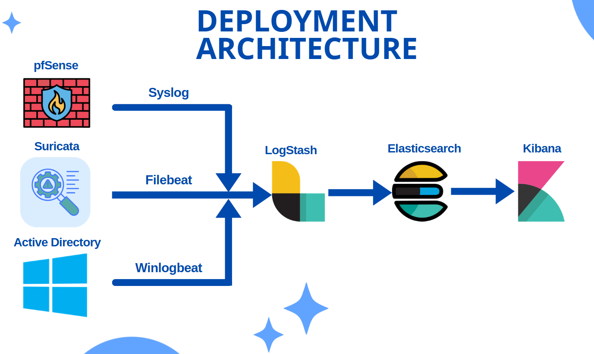
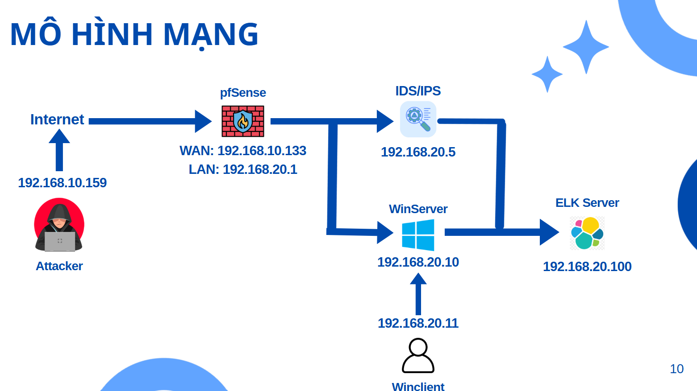

# 🔐 SOC ELK Project – Centralized Log Monitoring

## 📌 Overview
This project demonstrates a Security Operations Center (SOC) lab built using the ELK Stack to centralize, process, and analyze logs from multiple sources including Active Directory, Firewall, and IDS/IPS.

The goal of this lab is to simulate real-world attack scenarios and monitor how security events are generated, detected, and analyzed.

---

## 🏗️ Architecture

### 🔄 Log Flow
1. Windows AD logs are collected using Winlogbeat  
2. Firewall logs (pfSense) are forwarded via Syslog  
3. IDS alerts (Suricata) are generated in eve.json  
4. Logs are sent to Logstash for parsing  
5. Processed logs are stored in Elasticsearch  
6. Kibana is used for visualization and analysis  

---

## 🌐 Network Topology

The lab simulates an enterprise network with external attacker and internal monitoring system.

- **Attacker (192.168.10.159)**: External machine generating attacks from Internet  
- **:contentReference[oaicite:0]{index=0} Firewall**:
  - WAN: 192.168.10.133  
  - LAN: 192.168.20.1  
  - Performs NAT and forwards traffic into internal network  

- **Internal Network (192.168.20.0/24)**:
  - **IDS/IPS (192.168.20.5)** – monitors traffic using :contentReference[oaicite:1]{index=1}  
  - **Windows Server (192.168.20.10)** – AD & authentication logs  
  - **Windows Client (192.168.20.11)** – domain user machine  
  - **ELK Server (192.168.20.100)** – centralized logging system  

### 🔄 Traffic Flow
Attacker → pfSense (NAT) → Internal Network → IDS monitors traffic → Logs sent to ELK

## 🔧 Components

### ELK Stack
- **:contentReference[oaicite:0]{index=0}**: Stores and indexes logs  
- **:contentReference[oaicite:1]{index=1}**: Parses and processes logs  
- **:contentReference[oaicite:2]{index=2}**: Visualizes data and dashboards  

### Security Tools
- **:contentReference[oaicite:3]{index=3}**: Detects network attacks  
- **:contentReference[oaicite:4]{index=4}**: Controls and monitors network traffic  
- Windows Active Directory: Authentication & domain management  

### Log Shippers
- **:contentReference[oaicite:5]{index=5}**: Sends Windows logs  
- **:contentReference[oaicite:6]{index=6}**: Ships Suricata logs  

---

## 📊 Log Sources

### 🖥️ Windows Active Directory
- Event ID 4624 – Successful login  
- Event ID 4625 – Failed login  
- Event ID 4740 – Account lockout  

### 🔥 Firewall (pfSense)
- Allowed / Blocked traffic  
- NAT logs  
- Firewall rule matching  

### 🛡️ IDS/IPS (Suricata)
- Alert logs (eve.json)  
- Network intrusion detection  
- Suspicious payload detection  

---

## 🚨 Attack Scenarios & Detection

### 🔴 Scenario 1: Brute-force SSH Attack
- **Objective**: Attacker performs SSH brute-force to gain access to an internal client machine in the LAN  
- **Method**: Multiple login attempts via SSH service  
- **Detection**:
  - Authentication failure logs generated  
  - High number of failed login attempts observed  
- **Log Source**:
  - System logs / authentication logs  
- **SOC Insight**:
  - Identify abnormal login patterns  
  - Detect potential credential attacks  

---

### 🟠 Scenario 2: SQL Injection Attack
- **Objective**: Attacker sends malicious HTTP request to internal web server  
- **Payload**:
  - SQL Injection with `LOAD_FILE('/etc/passwd')`  
- **Detection**:
  - Detected by **Suricata rules (default + custom rules)**  
  - Alert generated in IDS logs (eve.json)  
- **Log Source**:
  - Suricata alerts  
- **SOC Insight**:
  - Detect web-based attacks  
  - Analyze payload signatures  
  - Validate IDS rule effectiveness  

---

### 🔵 Scenario 3: Brute-force RDP Attack (Domain Environment)
- **Objective**: Attacker brute-forces RDP access to a Windows client in domain  
- **Method**:
  - Attack from external network via **pfSense NAT**  
  - Target domain user account  
- **Detection**:
  - Event ID 4625 – Failed login attempts  
  - Event ID 4740 – Account lockout  
- **Log Source**:
  - Windows Security logs (forwarded via Winlogbeat)  
- **SOC Insight**:
  - Detect account compromise attempts  
  - Monitor domain authentication behavior  
  - Identify lateral movement risks  

---

## 📊 Kibana Dashboards

Dashboards created for monitoring:
- 🔍 Authentication Monitoring (AD logs)  
- 🌐 Network Traffic Overview  
- 🚨 Security Alerts (IDS + Firewall)  

Key visualizations:
- Failed login attempts over time  
- Top attacking IP addresses  
- IDS alert severity distribution  

---

## 📂 Project Resources
- 📑 Detailed demo & explanation: `demo.pptx`  

---

## 🔍 SOC Skills Demonstrated
- Log collection & centralization  
- Log parsing & normalization  
- Threat detection (IDS + logs)  
- Security event correlation  
- Attack simulation & analysis  
- Dashboard visualization  

---

## ⚙️ Deployment Notes
- ELK Stack deployed using Docker  
- Logstash receives:
  - Beats input (port 5044)  
  - Syslog input (port 514)  
- Suricata outputs logs to eve.json  
- pfSense forwards logs via Syslog  

---

## ⚠️ Limitations
- Lab-scale environment  
- Limited attack scenarios  
- Basic detection rules  

---

## 🚀 Future Improvements
- Integrate SIEM correlation rules  
- Add alerting (Email / Slack)  
- Expand attack scenarios  
- Improve detection rules & tuning  